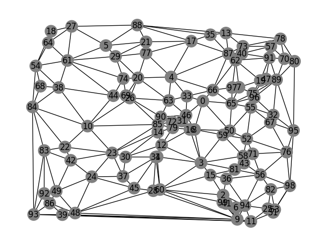
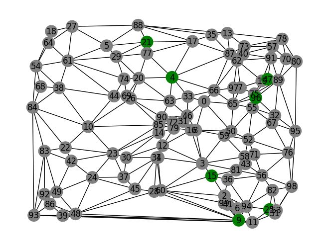
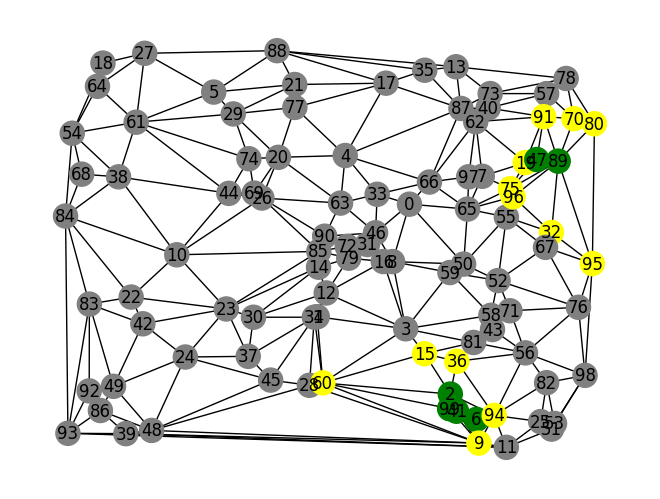
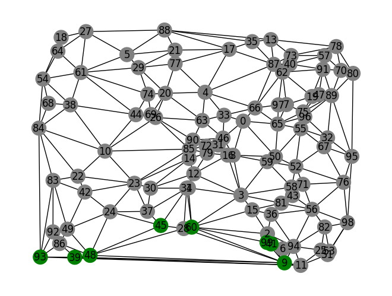
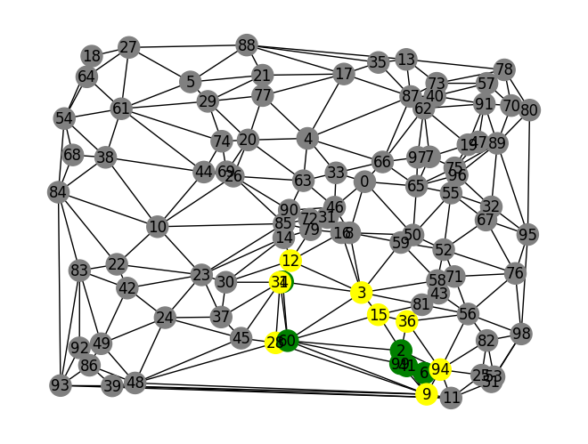
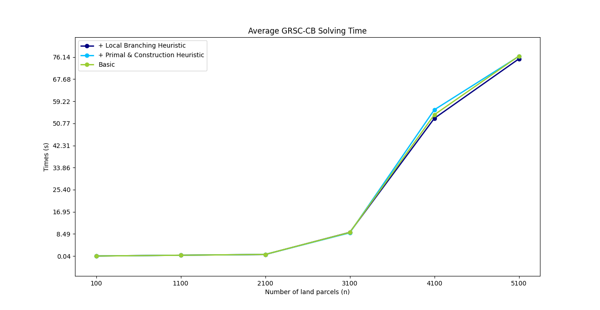

<!-- _backgroundColor: #1a3d2b -->
<!-- _color: white -->
<!-- _header: '' -->
<!-- _footer: '' -->

</img>
# Generalized Reserve Set Covering Problem with Buffer and Connectivity Requirements
#### Camilla Bigotto, Anna Guccione

Source: 


---
# Introduction
---
## The GRSC-CB problem
### Definition of the problem
* Design of nature reserves for ensuring the conservation of endangered wildlife
* Reserves must verify a series of spatial requirements:
    * **Connectivity**: to avoid spatial fragmentation
    *  **Buffer zones**: surrounding/protecting the core areas
* **General Reserve Set Covering Problem with Connectivity and Buffer Requirements**
---

## The GRSC-CB problem

### Modular Approach

| Model       | Description                                            |
| ----------- | ------------------------------------------------------ |
| **RSC**     | Minimum sites covering all species                     |
| **GRSC**    | + suitability quota, species groups, cost minimization |
| **GRSC-B**  | + buffer zone constraints                              |
| **GRSC-C**  | + connectivity constraints                             |
| **GRSC-CB** | B + C (full model)                                     |

* The solution is enhanced with:
    * Valid inequalities (cover, species, species-cover-cuts)
    * Construction + primal heuristic
    * Local branching heuristic

---
# Generalized Reserve Set Covering Problem

---
## RSC: Reserve Set Covering problem
### Definitions

<div class="cols">
<div>

* Given:
  * A set V of **land sites**
  * A set of **species** S
  * $\forall s \in S$ a set of suitable land sites $V_s \subseteq V$
* Find the minimum number of reserve sites such that each species is presented in the selected set of sites at least once.
* A **graph** was considered with:
  * as **nodes** the land sites
  * an **edge** is present between 2 land sites if they share a border


</div>
<div>



</div>
</div>


---

## RSC: Reserve Set Covering problem

### Variable

$x_i$ with $1 \leq i \leq |V|$ defined as:
$$
  \begin{align*}
  x_i =
  \begin{cases}
  1, & \text{if the land site $i \in V$ is selected}\\
  0, & \text{otherwise}
  \end{cases}
  \end{align*}
$$

### Constraint
#### COV
Each specie needs to be covered by a suitable land site.
$$
\sum_{i \in V_s} x_i\geq 1, \forall s \in S
$$

### Objective Function

**Minimize** the number of land sites

$$
\begin{align*}
\min \pi(x) = \sum_{i\in V} x_i\\
\end{align*}
$$

---

## GRSC: Generalized RSC

* Generalizes the RSC by adding **suitability scores**, **quotas** and **land costs**.

### Definitions

#### Quotas of ecological suitability

* $S_1$ $\subseteq S$ → set of species that need to stay in the core area
* $S_2$ $\subseteq S, S_1 \cup S_2 = S, S_1 \cap S_2 = \varnothing$ → the other species
* $w: V\times S \rightarrow \mathbb{R} ^+$ → **habitat suitability function** measures how advisable is a site $i \in V$ for a specie $s \in S$
* therefore we can define $V_s = \{i\in V| w(s,i) > 0\}$ 
* $\lambda_s$ $\geq 0$ → **minimum quota of ecological suitability** for $s$

---

## GRSC: Generalized RSC

### Definitions
#### Protection

* $s \in S$ is considered **protected** if $\sum_i w(i,s) \geq \lambda_s$
* $0\leq$ $P_1$ $\leq |S_1|$, $0\leq$ $P_2$ $\leq |S_2|$, minimum number of species respectively in $S_1$ and $S_2$ that the reserve needs to protect

#### Cost

* $c:V \rightarrow \mathbb{R} ^+$ → **cost function** of choosing the site $i \in V$ to be in the reserve

---

## GRSC: Generalized RSC

### Variables

* $x_i$ defined as before

* $z_i$, $1 \leq i \leq |V|$ → binary variables defined as:

  $$
  \begin{align*}
  z_i =
  \begin{cases}
  1, & \text{if the land site $i \in V$ is part of the core area}\\
  0, & \text{otherwise}
  \end{cases}
  \end{align*}
  $$

* $u_s$, $1 \leq s \leq |S|$ → binary variables defined as:

  $$
  \begin{align*}
  u_s =
  \begin{cases}
  1, & \text{if the specie $s \in S$ is protected by the reserve}\\
  0, & \text{otherwise}
  \end{cases}
  \end{align*}
  $$

The solution will be a tuple $(u,x,z)$

---

## GRSC: Generalized RSC

### Constraints

##### S1-SQ

If a specie in $S_1$ is protected, the habitat suitability score for the land sites part of the core area must be at least the minimum quota of ecological suitability of that specie.
$$
\sum_{i\in V_s} w(i, s)z_i \geq \lambda_s u_s \quad \forall s \in S_1
$$


##### S2-SQ

Similarly for a specie in $S_2$, considering land sites in the whole reserve.
$$
\sum_{i\in V_s} w(i, s)x_i \geq \lambda_s u_s \quad \forall s \in S_2
$$

---

## GRSC: Generalized RSC

### Constraints

##### S1-PROTECT

At least $P_1$ species of $S_1$ must be protected. 
$$
\sum_{s\in S_1} u_s \geq P_1
$$


##### S2-PROTECT

At least $P_2$ species of $S_2$ must be protected. 
$$
\sum_{s\in S_2} u_s \geq P_2
$$

---

## GRSC: Generalized RSC

### Constraints

##### LINK

If a site is in the core, then it must also be in the reserve.
$$
z_i \leq x_i \quad \forall i \in V
$$

### Objective function

##### COST

Function that indicates the cost that needs to be **minimized**.
$$
\gamma(u,x,z) = \sum_{i\in V} c_i x_i
$$

---
## GRSC: Generalized RSC
### GRSC model
###
$$
\begin{align*}
& GRSC : \min \{\gamma(u,x,z) | \\ & (S1\text{-}SQ), (S2\text{-}SQ), (S1\text{-}PROTECT), (S2\text{-}PROTECT), (LINK)\}
\end{align*}
$$


---
# Buffer and Connectivity requirements

---

## GRSC-B: GRSC with Buffer requirements

* For defining the buffer area, a concept of neighborhood is introduced.

### Definitions

#### $d$-neighborhood
* To model the buffer surrounding the selected core areas we define the $d$-neighborhood set of a node $i$ as 


* For $d \geq 0, d \in \mathbb{N}, i \in V$ the       $d$-neighborhood is defined as the set of sites at distance $d$ from $i$.
  $$
  \begin{align*}
  
  \delta_d (i) = \{j \in V_{i  \neq j} | \text{the number of jumps from $i$ and $j$ is max $d$} \}
  
  \end{align*}
  $$
* $\delta_d^+(i)$ it the d-neighborhood that contains also $i$.

> In the implementation: the distances are precomputed using `nx.ego_graph` and stored as a `frozenset`.

---

## GRSC-B: GRSC with Buffer requirements

### Constraints

##### d-BUFF.1

Every core site is surrounded by a buffer area of normal sites in its $d$-neighborhood
$$
z_i \leq x_j, \quad \forall j \in \delta_d(i), \quad \forall i \in V
$$

##### d-BUFF.2

Every normal site must have at least one core site in the $d$-neighborhood
$$
x_i \leq \sum_{j \in \delta_d(i)} z_j \quad \forall i \in V
$$

---

## GRSC-B: GRSC with Buffer requirements

### GRSC-B model:
###

$$
\begin{align*}
& GRSC\text{-}B : \min \{\gamma(u,x,z) | \\ & (S1\text{-}SQ), (S2\text{-}SQ), (S1\text{-}PROTECT), (S2\text{-}PROTECT), (LINK)\\& (d\text{-}BUFF.1), (d\text{-}BUFF.2) \}
\end{align*}
$$

---
## GRSC-C: GRSC with Connectivity requirements

### Definitions
#### $r$-arc-node-separator

* To model connectivity, a root $r$ is added to the graph, obtaining $G_r$, where each node is connected to the root with an arc
* The arcs $(r, i)$ are called **$r$-arcs** ($A_r$)
* Given a node $l$, an **$r$-arc-node-separator** ($W=(W_V, W_A)$) is the set of arcs and nodes  such that if they're removed from $G_r$, then the site $l$ can't be reached by $r$
* $W_l$ is the set of all $r$-arc-node-separators w.r.t $l$
* **Connectivity requirement**: every site must have a path from $r$

---

## GRSC-C: GRSC with Connectivity requirements

### Variables

* $(u, x, z)$ defined as before
* Let $y_i, 1 \leq i \leq |V|$ be an auxiliary variable 
  $$
  \begin{align*}
  y_i =
  \begin{cases}
  1, & \text{if the land site $i \in V$ is connected to $r$ via an arc $(r,i)$}\\
  0, & \text{otherwise}
  \end{cases}
  \end{align*}
  $$
* Each $y_i$ represents a **connected component root**.
### Constraints

Let $k$ be the max number of connected components in the reserve.

##### NCOMP

There's a max of $k$ connected components in the reserve.
$$
\sum_{j\in V} y_j \leq k
$$


---

## GRSC-C: GRSC with Connectivity requirements

### Constraints

##### ALLCON

If a site $i$ is connected to the root, then it must be considered in the reserve area.
$$
\sum_{i \in W_V} x_i + \sum_{j \in W_A} y_j \geq x_l, \quad \forall W \in W_l, \quad \forall l \in V
$$

##### YX

If the land site $l$ is in the reserve area of the solution, then for all the $W \in W_l$, I must have at least one node from $W_V$ or one arc from $W_A$. 
$$
y_i \leq x_i \quad \forall i \in V
$$

---

## GRSC-C: GRSC with Connectivity requirements

### GRSC-C model:

###
$$
\begin{align*}
& GRSC\text{-}C : \min \{\gamma(u,x,z) | \\ & (S1\text{-}SQ), (S2\text{-}SQ), (S1\text{-}PROTECT), (S2\text{-}PROTECT), (LINK) \\ &  (ALLCON), (YX), (NCOMP) \}
\end{align*}
$$

---

## GRSC-CB: GRSC with Buffer and Connectivity

### Constraints

##### YZ (replaces YX)

If a site $i$ is connected to the root, then it must be considered in the **core** area.
$$
y_i \leq z_i \quad \forall i \in V
$$

##### CORECON (replaces ALLCON)

If the land site $l$ is in the **core** area of the solution, then for all the $W \in W_l$, I must have at least one node from $W_V$ or one arc from $W_A$. 
$$
\sum_{i\in W_V} z_i + \sum_{j \in W_A } y_j \geq z_l, \quad \forall W \in W_l, \quad \forall l \in V
$$

---

## GRSC-CB: GRSC with Buffer and Connectivity

### GRSC-CB model:

###
$$
\begin{align*}
& GRSC\text{-}CB : \min \{\gamma(u,x,z) | \\ & (S1\text{-}SQ), (S2\text{-}SQ), (S1\text{-}PROTECT), (S2\text{-}PROTECT), (LINK) \\ & (d\text{-}BUFF.1), (d\text{-}BUFF.2) \\ &  (CORECON), (YZ), (NCOMP) \\ & (u, x, z, y) \in \{0,1\}^{|S|+3|V|} \}
\end{align*}
$$

---
# Branch-and-cut framework

---
## Branch-and-cut framework

* In the GRSC-CB and GRSC-C, the family of constraints caused by **connectivity cuts** (CORECON and ALLCON) are <u>exponential</u> in number
* Therefore, a **branch-and-cut** framework is built to separate the connectivity cuts
* `lazy constraints` are added to the model once a violation is found during optimization

> Only CORECON is described, since ALLCON is symmetrical


---

## Branch-and-cut framework
### Valid inequalities
* To improve lower bounds 3 families of valid inequalities are also separated

| Cut                            | Ensure that                                                  |
| ------------------------------ | ------------------------------------------------------------ |
| **SC** (Species Cuts)          | If a specie is protected, at least one node in $V_s$ is taken |
| **COVER** (Cover Inequalities) | At least one parcel from the $C_s$ is taken in the reserve   |
| **SCC** (Species-Cover Cuts)   | Like **SC**, but considering $C_s$ instead of $V_s$          |
* Where the set  $C_s \subset V_s$ (**Cover**) is such that  $V_s \setminus C_s$ is not enough to satisfy the sustainability quota for that specie
> In the implementation, SC cuts were not considered, since SCC cuts are stronger
---

## Branch-and-cut framework
### Constraint separation
#### CORECON (fractional) separation

* Let $\rho = (\tilde{u},\tilde{x},\tilde{z}, \tilde{y})$ is a solution of the LP relaxation at the current node of the branch-and-bound tree


* **Node splitting** is used to create a digraph: every node $i$ is split into two copies:
  * $i_{in}$ (entry)
  * $i_{out}$ (exit)
* The arcs and their capacities are defined as follows:
<div class="center">

  | Arc           | Capacity      |
  | ------------- | ------------- |
  | $i_{in} \to i_{out}$ | $\tilde{z}_i$ |
  | $r \to i_{in}$   | $\tilde{y}_i$ |
  | $i_{out} \to j_{in}$ | $\infty$      |

</div>

> The arc with $\infty$ capacity forces the flow to pass through the internal node arcs (with capacity $\tilde{z}_i$)

---

## Branch-and-cut framework
### Contraint separation
#### CORECON (fractional) separation


* For each node $\mathscr l$ with $\tilde z \geq \tau$, compute the **min-cut** from $r$ to $\mathscr l$ in the digraph.
* If the cut value is $\le \tilde z$, then this CORECON inequality is violated:
$$
\sum_{i\in \overline{W}_V} \tilde{z}_i + \sum_{j \in \overline{W}_A} \tilde{y}_j < \tilde{z}_l
$$
* The connectivity cut is defined as $(\overline{W}_V, \overline{W}_A)$ such that:

$$
\overline{W}_V = \{i \mid (i_{in}, i_{out}) \in \text{cut arcs}\}, \overline{W}_A = \{(r,i) \mid (r, i_{in}) \in \text{cut arcs}\}
$$


* The violated inequality is added as a **lazy constraint** to the LP.
> In the implementation: the min-cut is computed using the **igraph** method `mincut`

---

## Branch-and-cut framework
### Contraint separation
#### CORECON (Integer) separation 

* $H$ = connected component of the core induced by $\tilde{z}_i = 1$ that does **not** contain any root arc (i.e., $\tilde{y}_i = 0$ for all $i \in H$) → the component is disconnected from $r$

* The connectivity cut is defined as $(W_V, W_A)$ such that:
$$
\begin{align*}
W_V = \{j \mid \{i,j\} \in E,\ i \in H,\ j \notin H\}, W_A = H
\end{align*}
$$
* Add the CORECON inequality for each disconnected component

> In the implementation: the connected component are computed using the **NetworkX** method `connected_components`

---
## Branch-and-cut framework
### Contraint separation
#### CORECON  separation 

* In both the fractional and integer case, **downlifting** is done
* Not all $j \in W_A$ are considered, but only $j \leq \mathscr l$
* So all connected components are rooted to the node with smallest index

---
## Branch-and-cut framework

### Contraint separation

#### SCC separation
* Similar process to CORECON
* **Difference**: applied to the cover set $C_s$ (connected to a sink node) instead of a single node $\mathscr l$

#### COVER separation

* The cuts are the solutions of a knapsack-problem:

$$
\begin{align*}
\min \left\{\sum_{j\in V_s} \tilde{z}_j q_j \;\middle|\; \sum_{j\in V_s} w_j^s q_j \geq W_s - \lambda_s,\ \mathbf{q} \in \{0, 1\}^{|V_s|} \right\}
\end{align*}
$$

> To solve it, a heuristic is followed (greedy knapsack): sort nodes in non-decreasing way order of $\tilde{z}_j / w_j^s$; greedly pick until $\sum_{j\in C_s} w_j^s \geq W_s - \lambda_s$

---
## Branch-and-cut framework
### Implementation

At each **LP relaxation node** (`MIPNODE` callback):
  1. Separate **COVER** and separate **SCC** -> if violated, add cut 
  3. If no violated inequality is found, separate **CORECON** (fractional) -> if violated, add cut

At each **integer node** (`MIPSOL` callback):
1. Separate **CORECON** (integer) -> if violated, add cut

```python
model.Params.LazyConstraints = 1
model.optimize(callback)
...
def callback(model, where):
  if where == GRB.Callback.MIPSOL:
    ... # handle separate CORECON integer
    model.cbLazy(...)
  
  if where == GRB.Callback.MIPNODE:
    ... # handle separate COVER and SCC
    model.cbLazy(...)
    
    if not violated:
      ... # handle separate CORECON fractional 
      model.cbLazy(...)
```


---
# Heuristics
---

## Heuristics

### Construction heuristic


* The construction heuristic generates a starting solution for initializing the branch-and-cut
  * **Phase 1**: creates a feasible solution in a greedy fashion
  * **Phase 2**: runs a post-processing to remove unnecessary nodes from $S_z$

* The partial solution $S$ is stored as $(S_z, S_x)$ (core and reserve nodes) and $W_s(S)$ (current habitat scores)

---

## Heuristics

### Construction heuristic
* Let $T(S)$ = set of **helpful** nodes not yet in $S_z$:
a node is helpful if adding it to the core could protect at least one currently unprotected species.
#### Phase 1

1. Pick $k$ random nodes as roots (one per component); add them to $S_z$, expand $S_x$ with their buffer
2. **While** (PROTECT) not satisfied:
    - Find the shortest path from $S_z$ to any node in $T(S)$
    - Add all nodes on the path to the core; expand $S_x$ with their buffers
    - Update $T(S)$

> The computation of the shortest-path is done with the **NetworkX** Dijkstra algorithm `nx.multi_source_dijkstra`, weighted by a specific node-cost function that depends on suitability gain

---
## Heuristics

### Construction heuristic
#### Phase 2
* We iterate through the nodes $i \in S_z$ and check if, after removing $i$, the solution remains feasible.
* The iteration is started with the node that causes the largest improvement in the objective function if removed
* Together with $i$ we remove also the nodes from $\delta_d(i)$ which become redundant after removing $i$
* Repeat the process until no additional node can be removed

> The variables in the found solution are injected in the model as `Start` values


---

## Heuristics
### Primal heuristic
* Incorporated in the **branch-and-cut** framework (as a callback)
#### Phase 1

* Essentially the same as the construction heuristic, but the **node-cost** function is changed to account for nodes already/partially selected in the LP solution

#### Phase 2
* The same as the construction heuristic

> The found solution is injected via `cbSetSolution`

---
## Heuristics
### Local-branching heuristic

* Before the main MIP, the solution found by the construction heuristic is improved by adding the constraint: 
  $$
  \sum_{i \in S_z} z_i \geq |S_z|-r
  $$
* This seaches for a better solution in the $r$-neighborhood while ensuring that most of the core land parcels of the solution $S$ also belongs to the new solution
* $r$ is incremented iteratively until a better solution is found or until the iteration limit is reached
> In our implementation we used $r=5$, time limit= $20s, \Delta_r=5, r_{max}=20$


---
## Results
### Example
The system was tested on instances according to the quantities described in the paper.
* Given
  * number of land parcels: $n = 100$ 
  * number of species: $m = 40$
  * number of max connected areas: $k = 1$
  * buffer size: $d = 1$

* The habitat suitability score  is $w_i^s \in [20, 100]$ and it's zero:

  * for the external nodes and $s$ in $S_1$
  * with probability 20% if the species $s$ is in $S_1$, 10% if $s$ in $S_2$
* The cost of the land parcels is defined as $c_i \in [1, 100]$
* The suitability quota is defined as: $\lambda_s = \lceil 0.05 \rceil \sum_{i \in V_S} w^s_i$
* We generate a random instance graph using Delunaay triangulation


---
## Results
### Example

<div class="cols">
<div>

#### The GRSC model


</div>
<div>

#### The GRSC-B model


</div>
</div>

---
## Results
### Example
<div class="cols">
<div>

#### The GRSC-C model


</div>
<div>

#### The GRSC-CB model


</div>
</div>

---
## Results
### Scalability
* For the scalability test $n$ was increased with:
  * $n_{min} = 100$  
  * $n_{max} = 5100$
  * $n_{step} = 100$
* We compared the solving time of the model with basic configuration and with the heuristcs
* Results showed: 
  * little to no improvement using the heuristics
  * an exponential increase of solving time starting from $n=3000$ 


---
## Results
### Scalability



